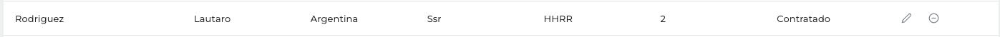

# Consultores

{: .no_toc }

## Vista general de la sección

  
En esta pantalla podremos ver los consultores en la tabla, poder agregar un nuevo consultor, modificarlo y/o eliminarlo. También podremos hacer una búsqueda de los consultores dentro de la tabla.

## En la tabla podemos encontrar los siguientes datos

### Apellido

Apellido del consultor.

### Nombre

Nombre del consultor.

### País

País del consultor.

### Seniority

Seniority del consultor.

### Área

Area en el que se encuentra el consultor.

### Nivel de inglés

Nivel de inglés que tenga el consultor.

### Contratado

Si se encuentra contratado o no el consultor.

### Acciones

Son todas las acciones que podemos hacer en los consultores (editar y/o eliminar).

- **Editar**: El usuario cuenta con la posibilidad de editar el consultor actual
- **Eliminar**: El usuario cuenta con la posibilidad de eliminar un consultor

## ¿Cómo creamos un nuevo consultor?

1. Para poder agregar a un nuevo consultor hacemos clic en el botón de arriba a la derecha llamado "Nuevo consultor".
   

2. Al hacer clic en el botón nos aparecerá la siguiente pantalla
   

   **Apellido**  
   Apellido del consultor.

   **Nombre**  
   Nombre del consultor.

   **Legajo**  
   Legajo del consultor.

   **País**  
   País del consultor.

   **Seniority**  
   Seniority del consultor.

   **Área**  
   Área en el que se encuentra el consultor.

   **Disponibilidad**  
   Es la disponibilidad de tiempo que posee el consultor (es de 0 a 1).

   **Contrato**  
   Si se encuentra contratado o no el consultor.

   **Fecha de inicio**  
   Fecha de inicio que entro empezó el consultor.

   **Fecha de final**  
   Fecha finalización de trabajo del consultor.

   **Nivel de inglés**  
   Nivel de inglés que tenga el consultor.

   **Consultor asignado (Opcional)**  
   Si el consultor está asignado se pone "si" y si no lo esta se pone "no" (recordemos que esta acción es opcional).

3. Completamos los datos y una vez que estamos seguros de tener los datos correctos, apretamos el botón llamado "Agregar consultor" para poder agregar un nuevo consultor y esperamos que se cargue el nuevo consultor. Nos aparecerá la siguiente notificación:  
   

---

## ¿Cómo editamos un consultor?

1. Lo primero que tenemos que hacer es ir al consultor que queremos editar en la pantalla  
   

2. Apretamos el siguiente botón dentro de la fila del consultor requerido:  
   

3. Nos abrirá una nueva pantalla (Igual a la pantalla de Agregar consultor) con los datos del consultor, desde ahí podemos hacer la modificación que requerimos.  
   

4. Una vez que estemos seguros de nuestras modificaciones hacemos click al botón "Guardar consultor", esperamos que la modificación esté lista y nos deberá aparecer una notificación (arriba a la derecha) con la siguiente información:  
   

---

## ¿Cómo eliminamos un consultor?

1. Lo primero que tenemos que hacer es ir al consultor que queremos eliminar en la pantalla  
   

2. Apretamos el siguiente botón dentro de la fila del consultor requerido:  
   

3. Nos va a abrir una nueva pantalla consultándonos si estamos seguros de eliminar el consultor.
   

4. Si estamos seguros de hacer esta acción, hacemos clic en el botón "Eliminar consultor".
   

5. Si todo está correcto y se eliminó el consultor nos aparecerá una notificación, avisando que se ha eliminado el consultor.  
   

## ¿Cómo vemos el total de consultores?

1. Para poder ver todos los consultores debemos enfocarnos dentro de la tabla:  
   

2. Dentro de la tabla vamos a encontrar arriba a la derecha para seleccionar si queremos mostrar todos los consultores o no.
   

3. Si apretamos la casilla de verificación que nos muestra, ahí nos aparecerán todos los consultores como en la siguiente imagen:
   

4. Si miramos en la paginación veremos que hubo un cambio en el total de la paginación indicándonos que estamos mostrando todos los consultores (antes eran 5 páginas, ahora son 7).

5. Si queremos volver a mostrar los consultores que nos mostraba en un inicio, volvemos a dar click nuevamente en la casilla de verificación y volverá todo como el principio.
   

---

## Errores que nos podemos encontrar en la sección  

  

Si tenemos algún error por falta de algún campo requerido al guardar vamos a tener este error. 

No se podrá borrar algún consultor que sigue activo en algún proyecto. 
