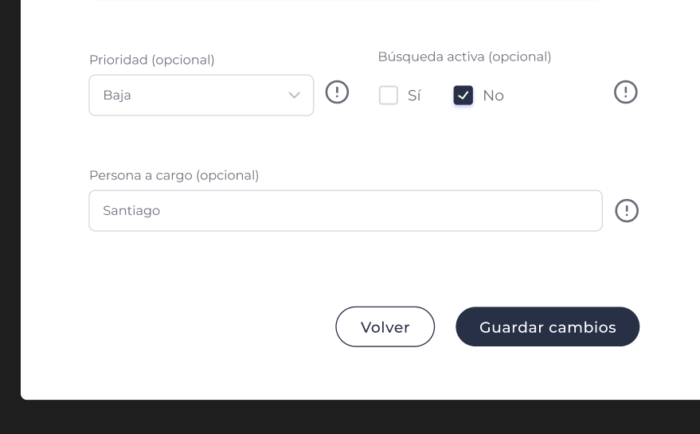
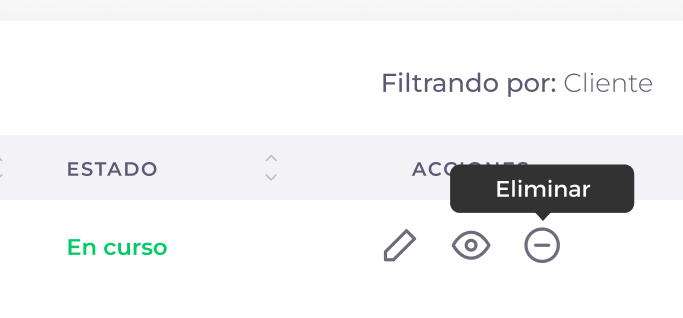

# Posiciones

{: .no_toc }

## Vista general de la sección

  
En la pantalla de posiciones, vamos a poder llevar el seguimiento de las posiciones que tiene cada cliente y los consultores asignados en las mismas. En la misma sección, también se puede filtrar por: Cliente, Consultor y Estado. También contamos con la posibilidad de buscar una posición.

En la lista de posiciones nos encontramos con las siguientes columnas:

### Prioridad

Indica el nivel de prioridad asignado a cada posición, representado por un indicador visual (flecha hacia arriba, abajo o al centro).

### Rol y Área

Muestra la información del rol específico (como React Developer, BI, Python) y el área a la que pertenece la posición (como Development, Data Science).

### Cliente

Indica el nombre del cliente que tiene la posición asignada (como Pi Consulting, etc.).

### Proyecto

Muestra el proyecto asociado a la posición.

### Búsqueda Activa

Indica si la posición está activamente en búsqueda de candidatos (muestra SI o NO).

### Ejecutivo

Muestra el nombre del ejecutivo o persona a cargo de la posición cuando está asignado.

### Estado

Indica el estado actual de la posición (Open,Negotiation, Finished, On Going, etc.).

### Acciones

Dentro de las acciones nos podemos encontrar con: Editar posición, Ver posición y Cancelar posición. 

- **Editar posición**: El usuario cuenta con la posibilidad de editar la posición actual.
- **Ver posición**: El usuario cuenta con la posibilidad de ver el detalle de la posición y editarla en caso de que lo necesite.
- **Cancelar posición**: El usuario cuenta con la posibilidad de cancelar la posición actual.

---

## ¿Cómo creamos una posición?

1. Lo primero que tenemos que hacer, es ir al botón de "Nueva posición".
    

2. Luego de apretar el botón de "Nueva posición" se nos abrirá el siguiente formulario:
       Para llenar el formulario, vamos a tener que ingresar los siguientes datos:  
    
   **Cliente** 
   Seleccionamos el cliente donde se creará la posición de la lista desplegable. 
   
   **Proyecto** 
   Seleccionamos el proyecto en el cual se creará la posición. Es necesario seleccionar primero el cliente para que se muestren sus proyectos. 
   
   **Área** 
   Seleccionamos el área a la que pertenecerá la posición nueva de la lista desplegable. 
   
   **Tiempo en proyecto (FTE)** 
   Ingresamos el equivalente de tiempo completo (Full Time Equivalent) para esta posición. Por ejemplo, FT = 1 para tiempo completo. 
   
   **Rol** 
   Ingresamos el rol específico que cumplirá la persona en esta posición. 
   
   **Seniority** 
   Seleccionamos el nivel de seniority requerido para la posición de la lista desplegable. 
   
   **Estado** 
   Seleccionamos el estado inicial de la posición de la lista desplegable (Open, Negotiation, etc.). 
   
   **Fecha de inicio y Fin** 
   Seleccionamos las fechas de inicio y finalización para la posición utilizando el selector de calendario. 
   
   **Descripción del proyecto (Opcional)** 
   Ingresamos una breve descripción del proyecto y responsabilidades. Esto ayudará a quien necesite ver el detalle de la posición. 
   
   **Ejecutivo a cargo (Opcional)** 
   Ingresamos el nombre del ejecutivo a cargo. 
   
   **Área** 
   Seleccionamos un área específica para obtener los específicos de esa área (campo adicional para detalles específicos). 
   
   **Prioridad (Opcional)** 
   Seleccionamos el nivel de prioridad que tiene la posición nueva de la lista desplegable. 
   
   **Búsqueda activa (Opcional)** 
   Activamos este interruptor si la posición está actualmente en búsqueda activa de candidatos. 
   
   **Persona a cargo (Opcional)** 
   Ingresamos el nombre de la persona responsable del proyecto o posición. 

3. Una vez completado el formulario, le damos al botón "Crear posición"  
   

4. Una vez finalizado este proceso, vamos a ver una notificación confirmando que la posición fue creada con éxito.

---

## ¿Cómo edito una posición?

 

1. Para editar una posición, debemos ir a la barra de acciones y seleccionar el primer botón.
   

2. Una vez seleccionado el botón, se nos abrirá el formulario completo con todos los datos que contiene esa posición.

3. Una vez modificado los datos que necesitemos, apretamos "Guardar cambios".
   

## ¿Cómo veo el detalle de una posición?

1. Para ver el detalle de una posición, debemos ir al segundo botón de la barra de acciones.
   

2. Una vez seleccionado el botón, accederemos a ver el detalle de la posición.

---

## ¿Cómo cancelo una posición?

1. Para cancelar una posición, debemos seleccionar una posición que deseemos cancelar y apretar el tercer botón de la barra de acciones. Esta acción cambia el estado de la posición a "Cancelada" pero mantiene sus datos en el sistema para referencia histórica.  
   

2. Una vez presionado el botón, vamos a recibir una notificación emergente confirmando que la posición fue cancelada con éxito.

## Descargar Informe de Posiciones
Descarga un informe de las posiciones en CSV 
   