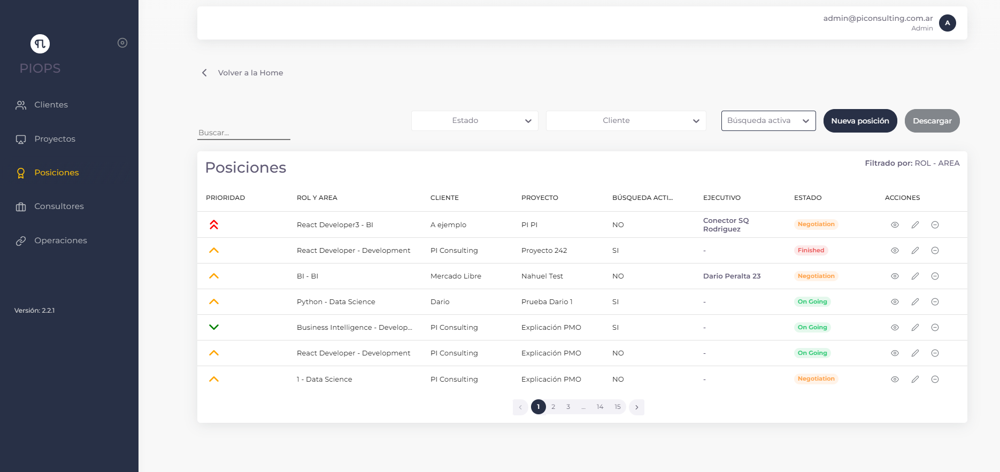
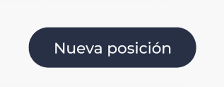

# Posiciones

{: .no_toc }

## Vista general de la sección

  
En la pantalla de posiciones, vamos a poder llevar el seguimiento de las posiciones que tiene cada cliente y los consultores asignados en las mismas. En la misma sección, también se puede filtrar por: Cliente, Consultor y Estado. También contamos con la posibilidad de buscar una posición.

En la lista de posiciones nos encontramos con: Posiciones, Clientes, Proyectos, Consultores, Estado y acciones.

### Posiciones

Cuenta con el detalle de la posición, el área en el que se encuentra esa posición y el nivel de prioridad que tiene la misma.

### Clientes

Indica el nombre del cliente que tiene la posición asignada.

### Proyectos

Indica el proyecto en curso que cuenta con la posición asignada.

### Consultores

Indica si la posición tiene o no un consultor asignado.

### Estado

Indica el estado de la posición, los cuales pueden ser: Abierta, en negociación, en curso, finalizada y cancelada.

---

### Acciones

Dentro de las acciones nos podemos encontrar con: Editar posición, Ver posición y Eliminar posición. 

- **Editar posición**: El usuario cuenta con la posibilidad de editar la posición actual.
- **Ver posición**: El usuario cuenta con la posibilidad de ver el detalle de la posición y editarla en caso de que lo necesite.

---

## ¿Cómo creamos una posición?

1. Lo primero que tenemos que hacer, es ir al botón de "Nueva posición".
    

2. Luego de apretar el botón de "Nueva posición" se nos abrirá el siguiente formulario:
    
   Para llenar el formulario, vamos a tener que ingresar los siguientes datos:  
    
   **Cliente** 
   Nombre del cliente donde se creará la posición. 
   **Proyecto** 
   Indicamos el proyecto en el cual se creará la posición. 
   **Área**  
   Indicamos el área a la que pertenecerá la posición nueva. 
   **FTE** 
   Indicamos el equivalente de tiempo en proyecto de la posición. 
   **Rol** 
   Indicamos el rol que cumplirá la posición. 
   **Estado** 
   Indicamos el estado en el cual se encuentra la posición (Como es nueva, lo más probable es que pongamos "Open" como estado). 
   **Fecha de inicio y final (Opcional)** 
   Indicamos cuándo inicia y termina el proyecto. 
   **Descripción** 
   Ingresamos una breve descripción del proyecto. Esto ayudará a quien necesite ver el detalle de la posición. 
   **Prioridad** 
   Seleccionamos el tipo de prioridad que tiene la posición nueva, las prioridades que podemos elegir son: Baja, media, alta. 
   **Búsqueda activa** 
   Indicamos si la búsqueda de esta nueva posición está abierta o no. 
   **Persona a cargo (opcional)** 
   Ingresamos el nombre de la persona que está a cargo de esta posición. 

3. Una vez completado el formulario, le damos al botón "Crear posición"  
   

4. Una vez finalizado este proceso, vamos a ver una notificación confirmando que la posición fue creada con éxito.

---

## ¿Cómo edito una posición?

 

1. Para editar una posición, debemos ir a la barra de acciones y seleccionar el primer botón.
   

2. Una vez seleccionado el botón, se nos abrirá el formulario completo con todos los datos que contiene esa posición.

3. Una vez modificado los datos que necesitemos, apretamos "Guardar cambios".
   

## ¿Cómo veo el detalle de una posición?

1. Para ver el detalle de una posición, debemos ir al segundo botón de la barra de acciones.
   

2. Una vez seleccionado el botón, accederemos a ver el detalle de la posición.

---

## ¿Cómo elimino una posición?

1. Para eliminar una posición, debemos seleccionar una posición que deseemos eliminar y apretar el tercer botón de la barra de acciones, el mismo elimina automáticamente la posición y todos los datos que contenga.  
   

2. Una vez presionado el botón, vamos a recibir una notificación emergente avisando que la posición fue eliminada con éxito.
