# Proyectos

{: .no_toc }

## Vista general de la sección

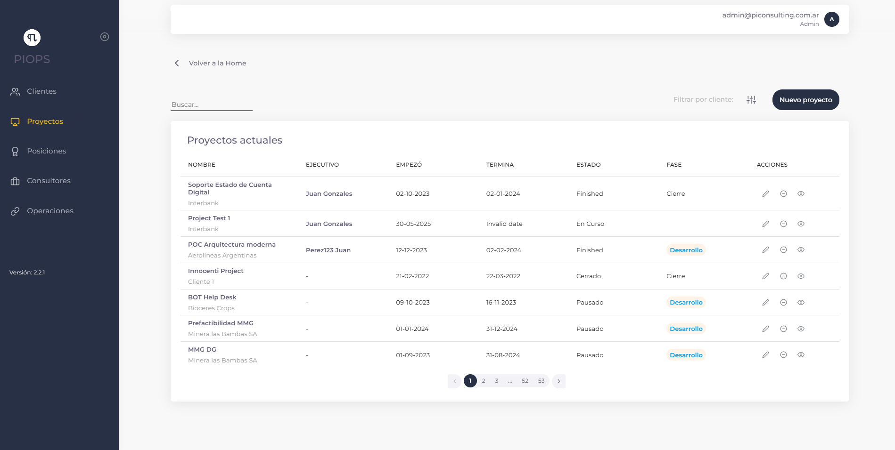  
En esta sección, los usuarios podrán acceder a una tabla detallada de los proyectos actuales que han sido cargados en la aplicación. Cada proyecto se presenta con información relevante y completa, que incluye el **nombre del proyecto**, el **cliente asociado**, las **fechas de inicio** y **finalización**, las **fechas de inicio real** y **fechas de fin real**, el **estado** actual del proyecto y la **fase** en la que se encuentra hasta el momento.  
 
Esta vista proporciona una visión general completa y actualizada de todos los proyectos en curso, lo que permite a los usuarios mantenerse al tanto del estado de proyecto y tomar decisiones informadas en función del progreso y las fechas límite. Además, la disponibilidad de información detallada sobre el cliente asociado en cada proyecto facilita la identificación rápida y precisa de los proyectos relacionados con cada cliente específico, optimizando así la eficiencia y organización en la gestión de múltiples proyectos y clientes.

---

## Filtrando proyectos y clientes

  
Para facilitar la búsqueda y organización de proyectos, el usuario podrá utilizar la función de filtrado.

### Filtro por nombre

1. Localizar el buscador ubicado en la parte superior izquierda de la vista general con la palabra "Buscar proyecto"
2. Ingresar el nombre del proyecto que quiere buscar.
3. A medida que se escribe el nombre del proyecto o nombre del cliente, la tabla comenzará a mostrar automáticamente los resultados coincidentes en tiempo real.

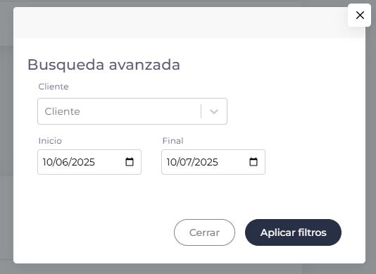  

### Filtro por cliente

1. Hacer clic en el selector desplegable de "Filtro por Cliente"
2. Seleccionar el cliente específico cuyos proyectos desea visualizar
3. La tabla se actualizará mostrando únicamente los proyectos asociados al cliente seleccionado

### Filtro por rango de fechas

1. Localizar los selectores de fecha "Desde" y "Hasta" en la barra de filtros
2. Seleccionar la fecha inicial en el campo "Desde"
3. Seleccionar la fecha final en el campo "Hasta"
4. La tabla se actualizará mostrando únicamente los proyectos cuya fecha de inicio se encuentre dentro del rango seleccionado

Los filtros pueden combinarse para realizar búsquedas más específicas. Por ejemplo, se pueden filtrar proyectos de un cliente específico que además se encuentren dentro de un determinado rango de fechas.

---

## ¿Cómo agregamos un proyecto?

Los usuarios tendrán la capacidad de crear nuevos proyectos directamente desde esta sección. A continuación, se detallará como agregar un nuevo proyecto.

1. Localizamos el botón de "Nuevo proyecto" en la parte superior derecha de la vista general.

   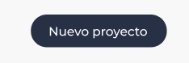

2. Hacer clic en el botón. Se nos abrirá un modal con el formulario de alta de un proyecto donde vamos a rellenar todos los campos.

   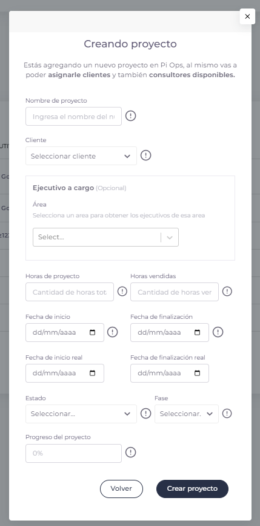

3. Ingresamos el nombre del proyecto, este nombre debe ser único y no coincidir con algún proyecto existente en la plataforma.

   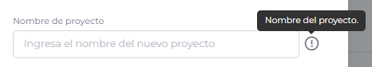

4. Seleccionamos el cliente que pertenece el proyecto en la lista despegable.

   

5. Seleccionamos el ejecutivo a cargo, seleccionamos primero el Area de donde se obtiene los ejecutivos y despues el ejecutivo a cargo, este campo es opcional

   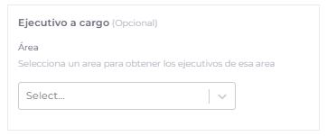

6. Ingresamos la cantidad de horas totales de desarrollo del proyecto.

   

7. Ingresamos la cantidad de horas totales vendidas.

   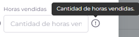

8. Ingresamos fecha de Inicio del proyecto y la fecha de finalización del proyecto.
   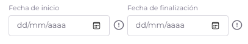

9. Seleccionamos de la lista despegable el estado en el que se encuentra el proyecto. Los estados disponibles son:
   - **En Curso**: El proyecto se encuentra activo con tareas en progreso según la planificación establecida
   - **Pausado**: El proyecto ha sido temporalmente detenido por razones específicas (espera de recursos, reevaluación de prioridades, etc.)
   - **Cerrado**: El proyecto ha finalizado completamente, cumpliendo con los objetivos establecidos o por decisión de la dirección
   
   
   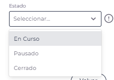

10. Seleccionamos de la lista despegable la fase en la que se encuentra el proyecto. Las fases disponibles son:
   - **Inicio**: El proyecto está en su etapa inicial donde se definen objetivos, alcance, se identifican interesados y se elabora el plan de trabajo
   - **Desarrollo**: El proyecto está en la fase principal de ejecución donde se realizan las actividades planificadas, se crean entregables y se monitorea el avance
   - **Cierre**: El proyecto está en su etapa final donde se completan y verifican los entregables, se documenta la finalización y se liberan recursos
   
   
   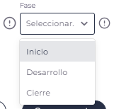

11. indicamos el porcentaje del avance en cual se encuentra el proyecto indicando del 0 al 100%.
    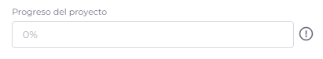

Finalmente, una vez rellenado todos los campos existentes para crear un proyecto finalizamos el proceso haciendo clic en "Crear proyecto" y esperamos la confirmación de la creación del proyecto.

---

## ¿Cómo editamos un proyecto?

Esta sección también permitirá a los usuarios editar los proyectos existentes en caso de que se necesite. Para editar un proyecto deben seguir los siguientes pasos.

1. Localizamos en la tabla de proyectos la columna de **ACCIONES** .
2. Identificamos el icono designado para la edición (icono de lápiz).

   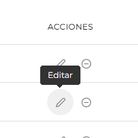

3. Hacemos clic en el icono de edición.
4. Se volverá a abrir el mismo modal con el formulario esta vez con los datos del proyecto seleccionado.
5. Modificamos el cambio que se necesite.
6. Hacemos clic en "Guardar cambios" para que impacten en la aplicación.  
   

---

## ¿Cómo eliminamos un proyecto?

En caso de que un proyecto haya sido concluido o desestimado, los usuarios podrán eliminarlo de la lista. La opción de "Eliminar proyecto" permitirá retirar de manera definitiva el proyecto seleccionado, asegurando que la lista de proyectos refleje siempre el estado actual de las tareas en curso, **los proyectos solo se podrán eliminar si no tienen clientes y consultores asignados al proyecto**.

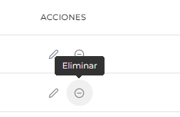

1. Localizamos en la tabla proyectos la columna **ACCIONES**
2. Identificamos el icono designado para la eliminación de proyectos (icono con signo menos).
3. Hacemos clic en el icono de 'Eliminar'.
4. A continuación, recibiremos una advertencia de que la acción no se puede deshacer.  
   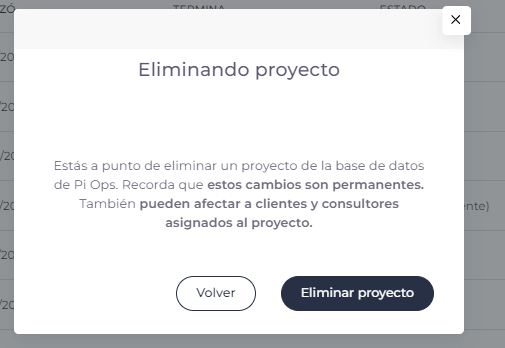

5. Para que los cambios impacten en el sistema hacemos clic en el botón "Eliminar proyecto" para confirmar la acción.

## Errores que nos podemos encontrar en la sección  

  
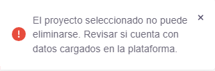

1. Esta notificación de error alerta que se está queriendo eliminar un proyecto que tiene consultores asignados, verifique que el proyecto no tenga consultores asignados antes de eliminarlos.  

   

2. Esta notificación alerta que cuando se intentó crear el proyecto hubo un fallo y no se pudo crear, puede llegar a deberse por problemas de conexión o tal vez de servidor, cerrar y volver a intentarlo. 

   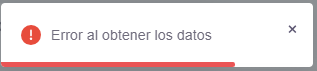

3. Esta notificación advierte que no se pudieron obtener los datos de la sección, puede deberse a problemas de conexión
